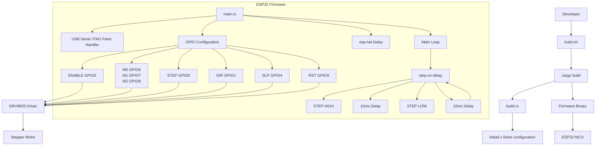

# Dependencies

* rust and cargo
* espflash 
	- to use this you need to `cargo install espflash` so that it's available in your shell path
	- allows you to flash the esp32 with the binary target that cargo compiled from the rust code and create packages
---

# Architecture

