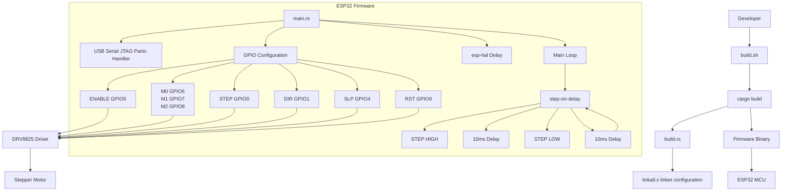

# Architecture



# Component View

```text
+--------------------------------------------------+
|                  Host Computer                   |
|--------------------------------------------------|
| build.sh                                         |
| cargo build                                      |
| espflash                                         |
+----------------------+---------------------------+
                       |
                       v
+--------------------------------------------------+
|                    build.rs                      |
|--------------------------------------------------|
| linker configuration                             |
| linker diagnostics                               |
| missing symbol troubleshooting                   |
+----------------------+---------------------------+
                       |
                       v
+--------------------------------------------------+
|                ESP32 Firmware                    |
|--------------------------------------------------|
| main.rs                                          |
| panic handler                                    |
| GPIO initialization                              |
| motor control loop                               |
+----------------------+---------------------------+
                       |
                       v
+--------------------------------------------------+
|                Motor Control Layer               |
|--------------------------------------------------|
| step_on_delay()                                  |
| pulse generation                                 |
| fixed timing (10ms high / 10ms low)              |
+----------------------+---------------------------+
                       |
                       v
+--------------------------------------------------+
|                Hardware Interface                |
|--------------------------------------------------|
| GPIO0  -> STEP                                   |
| GPIO1  -> DIR                                    |
| GPIO4  -> SLEEP                                  |
| GPIO5  -> ENABLE                                 |
| GPIO6  -> M0                                     |
| GPIO7  -> M1                                     |
| GPIO8  -> M2                                     |
| GPIO9  -> RESET                                  |
+----------------------+---------------------------+
                       |
                       v
+--------------------------------------------------+
|                   DRV8825                        |
+----------------------+---------------------------+
                       |
                       v
+--------------------------------------------------+
|                 Stepper Motor                    |
+--------------------------------------------------+
```
